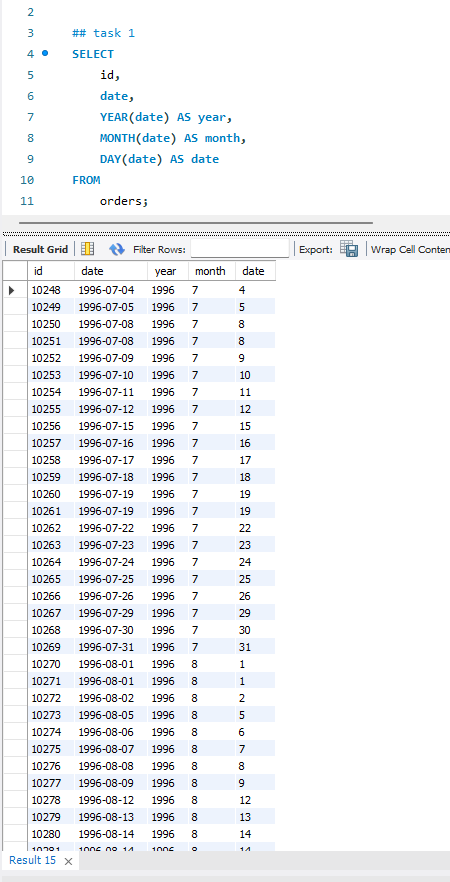
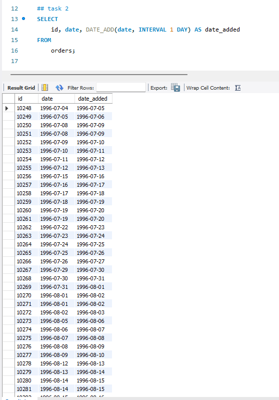
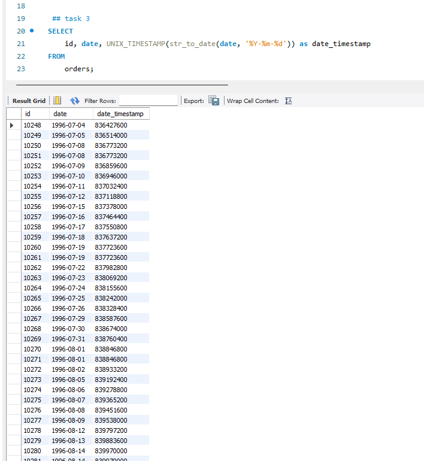
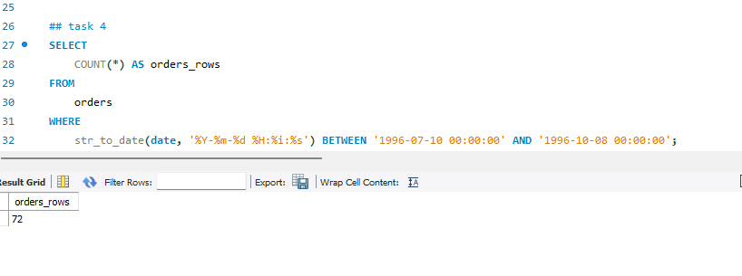
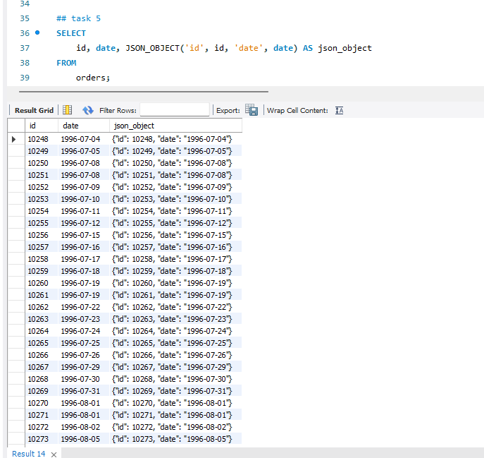

# Homework 5 for Neoversity

## Тема 7. Робота з часом. Додаткові вбудовані SQL функції

## Опис домашнього завдання:

Мета цього завдання — попрактикуватись використовувати основні функції для операцій із часом в SQL та трохи працювати з JSON-атрибутами.
Ці навички необхідні для розв’язання реальних завдань у сфері аналітики, розробки програмного забезпечення та обробки великих обсягів даних.

### Завдання 1

Напишіть SQL-запит, який для таблиці orders з атрибута date витягує рік, місяць і число. Виведіть на екран їх у три окремі атрибути поряд з атрибутом id та оригінальним атрибутом date (всього вийде 5 атрибутів).

```
SELECT
    id,
    date,
    YEAR(date) AS year,
    MONTH(date) AS month,
    DAY(date) AS date
FROM
    orders;
```



### Завдання 2

Напишіть SQL-запит, який для таблиці orders до атрибута date додає один день. На екран виведіть атрибут id, оригінальний атрибут date та результат додавання.

```
SELECT
    id, date, DATE_ADD(date, INTERVAL 1 DAY) AS date_added
FROM
    orders;
```



### Завдання 3

Напишіть SQL-запит, який для таблиці orders для атрибута date відображає кількість секунд з початку відліку (показує його значення timestamp). Для цього потрібно знайти та застосувати необхідну функцію. На екран виведіть атрибут id, оригінальний атрибут date та результат роботи функції.

```
SELECT
    id, date, UNIX_TIMESTAMP(str_to_date(date, '%Y-%m-%d')) as date_timestamp
FROM
    orders;
```



### Завдання 4

Напишіть SQL-запит, який рахує, скільки таблиця orders містить рядків з атрибутом date у межах між 1996-07-10 00:00:00 та 1996-10-08 00:00:00.

```
SELECT
    COUNT(*) AS orders_rows
FROM
    orders
WHERE
    str_to_date(date, '%Y-%m-%d %H:%i:%s') BETWEEN '1996-07-10 00:00:00' AND '1996-10-08 00:00:00';
```



### Завдання 5

Напишіть SQL-запит, який для таблиці orders виводить на екран атрибут id, атрибут date та JSON-об’єкт {"id": <атрибут id рядка>, "date": <атрибут date рядка>}. Для створення JSON-об’єкта використайте функцію.

```
SELECT
    id, date, JSON_OBJECT('id', id, 'date', date) AS json_object
FROM
    orders;
```


